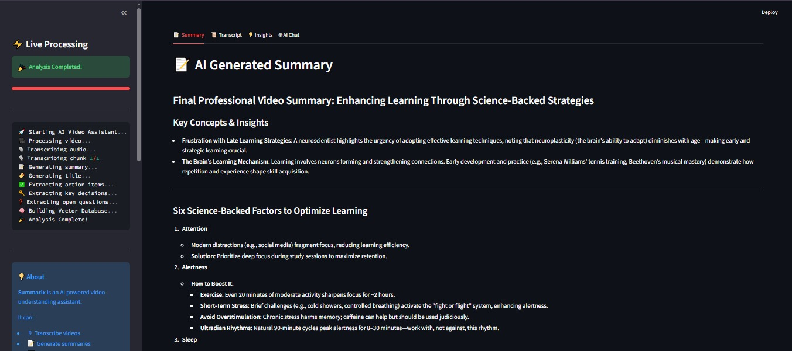
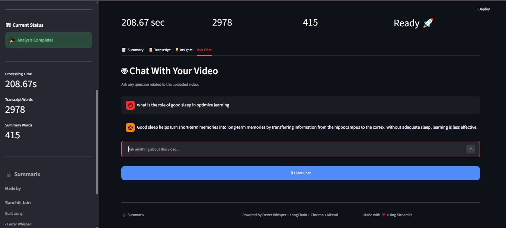

# 🎥 Summarix - AI Powered Video Understanding Platform

<div align="center">

### **Understand Any Video with AI**

Generate **Transcripts**, **Summaries**, **Action Items**, **Key Decisions**, and **Chat with your Video** using Retrieval-Augmented Generation (RAG).

Built with **Python**, **Streamlit**, **Faster Whisper**, **LangChain**, **ChromaDB**, and **Mistral AI**.

</div>

---

## ✨ Features

* 🎥 Accepts **YouTube URLs** as input
* 📂 Supports **Local Video Files**
* 🎙️ Automatic Speech-to-Text using **Faster Whisper**
* 🌍 Optional Translation to English
* 📝 AI Generated Video Summary
* 🏷️ Automatic Title Generation
* ✅ Extract Action Items
* 🔑 Detect Key Decisions
* ❓ Find Open Questions
* 🤖 Ask Questions about the Video using RAG
* 📚 ChromaDB Vector Store
* 🎨 Beautiful Dark Theme Streamlit UI
* 📥 Download Transcript & Summary

---

## 🚀 Demo Workflow

```text
Video Input
      │
      ▼
Audio Extraction
      │
      ▼
Audio Chunking
      │
      ▼
Whisper Transcription
      │
      ▼
Transcript
      │
      ├───────────────┐
      ▼               │
Video Summary         │
      ▼               │
Title Generation      │
      ▼               │
Action Items          │
Key Decisions         │
Open Questions        │
      ▼
Create Vector Store
      ▼
RAG Question Answering
      ▼
AI Chat Interface
```

---

## 📸 Application Screenshots

<table>
<tr>
<td align="center">
<b>🏠 Home Page</b><br><br>

</td>

<td align="center">
<b>⚡ Live Processing</b><br><br>

</td>
</tr>

<tr>
<td align="center">
<b>📝 Summary & Insights</b><br><br>

</td>

<td align="center">
<b>🤖 AI Chat</b><br><br>

</td>
</tr>
</table>
---

## 🛠️ Tech Stack

### Frontend

* Streamlit
* Custom CSS

### Backend

* Python

### AI / ML

* Faster Whisper
* LangChain
* ChromaDB
* HuggingFace Embeddings
* Mistral AI

### Libraries

* yt-dlp
* pydub
* sentence-transformers
* chromadb
* python-dotenv

---

## 📂 Folder Structure

```text
Summarix
│
├── app.py
├── main.py
├── requirements.txt
│
├── core
│   ├── extractor.py
│   ├── rag_engine.py
│   ├── summarize.py
│   ├── transcriber.py
│   └── vector_store.py
│
├── utils
│   └── audio_processor.py
│
├── downloads
├── vector_db
└── README.md
```

---

## ⚙️ Installation

Clone the repository

```bash
git clone https://github.com/YOUR_USERNAME/Summarix.git
```

Move into the project

```bash
cd Summarix
```

Create a virtual environment

### Windows

```bash
python -m venv .venv
.venv\Scripts\activate
```

### Linux / macOS

```bash
python3 -m venv .venv
source .venv/bin/activate
```

Install dependencies

```bash
pip install -r requirements.txt
```

Create a `.env` file

```text
MISTRAL_API_KEY=YOUR_API_KEY
```

Run the application

```bash
streamlit run app.py
```

---

## ⚠️ Important Notes

### 🌐 Live Demo Limitations

This application is deployed on **Streamlit Community Cloud (Free Tier)**.

While the complete application works when run locally, the hosted demo has a few limitations due to platform restrictions.

### 1️⃣ YouTube URL Processing

The application supports both:

* 🎥 YouTube URLs
* 📂 Local Video Uploads

However, **YouTube URL processing may not work in the hosted demo**.

This is **not a limitation of the project itself**. YouTube may block download requests originating from shared cloud servers, resulting in an HTTP 403 (Forbidden) error.

**Recommendation:**

* ✅ Use **Local Video Upload** when testing the live demo.
* 💻 Run the project locally to use the YouTube URL feature without these cloud restrictions.

---

### 2️⃣ Large Video Files

The application is designed to process long videos by splitting audio into manageable chunks before transcription.

However, the hosted demo runs on **Streamlit Community Cloud's free-tier resources**, which have limitations on CPU, RAM, storage, and execution time.

For the best experience in the live demo:

* ✅ Recommended video length: **up to 30–60 minutes**
* ✅ Moderate file sizes provide the best performance
* ⏳ Processing time depends on video duration and server load

When running the project locally, these cloud resource limitations do not apply, allowing significantly larger videos to be processed (subject to your system's hardware capabilities).

---

### ⏳ Processing Time

The first execution may take **2–5 minutes** because the application performs multiple AI tasks:

* Audio extraction
* Audio chunking
* Speech-to-text transcription
* AI summarization
* Embedding generation
* Vector database creation
* RAG initialization

Please wait until processing is complete before refreshing or closing the application.

The sidebar displays the current processing stage in real time.


---

## 💡 Future Improvements

* ⏱ Timestamped Transcript
* 👥 Speaker Diarization
* 🌐 Multi-language Chat
* 📄 PDF Export
* ☁️ Cloud Deployment
* 🐳 Docker Support
* 🎬 Video Chapters
* 🎤 Speaker-wise Summary

---

## 👨‍💻 Author

**Sanchit Jain**

B.Tech Electrical Engineering
Netaji Subhas University of Technology (NSUT)

Interested in:

* Artificial Intelligence
* Generative AI
* Machine Learning
* Deep Learning
* Full Stack Development

---

## ⭐ Support

If you found this project useful, consider giving it a ⭐ on GitHub.

It helps others discover the project and motivates further development.
